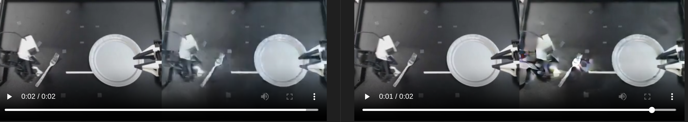
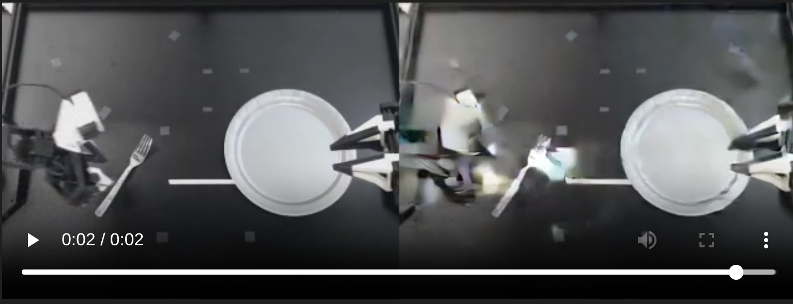

## Dataset
lerobot/aloha_static_fork_pick_up dataset

Total dataset: 100 episodes, 60,000 samples
Train split: 90 episodes, 54,000 samples
Val split: 10 episodes, 6,000 samples

For this specific fresh400 run, batch size is 1 and max steps is 400, so it only trained on 400 sampled batches, about 0.74% of one full pass over the 54,000-sample training split.

In order, for the same run there is checkpoint 200, 300 and 400. The 200 checkpoint is the best one. The model might not be learning how to move correctly

Train on episode 1 and evaluate on episode one to see if this architecture can overfit one trajectory.

## Full fine tuning
Managed to fully fine tune without OOM. 
Configs: 224x128, batch_size=1, subset_size=1, overfit_one_batch=true, conditioning_mode=none, gradient_checkpointing=true, runtime bfloat16, and optimizer_name=adafactor
- Smaller dimensions 224x128
- Moved train modules to the runtime dtype
- A

## Gradient checkpointing
A short startup-only head-mode probe with `gradient_checkpointing=false` still fit at real auto batch size `4`, so the operator-requested no-checkpointing idea is feasible for the smaller `head` branch, but that branch turned out to be structurally wrong.

## ?Batch size
Currently doing 1, might go OOM if I increase it. To test

## Action encoder
pre-LayerNorm is applied to each action token independently before projection
test_wan_vace_conditioning.py (line 64): scaling the actions by 1.5 gives almost the same output tokens when input LayerNorm is enabled.
maybe use action_input_layernorm=False

## ?Dimension
The smaller the dimension, the quicker the training and inference and so iteration, yet what impacts does it have?
If I find a good infrastrcutre for the small dimension, will it scale to the larger one?

## Process

Start every new architecture branch from the same base DiT checkpoint.
Evaluate every checkpoint against the untouched base-DiT baseline on the fixed slice. If the new architecture is worst than the base-DiT after step 100, stop it.
Keep a second comparison against best-so-far motion, but do not let a blurry post-trained model become the required parent.
If a branch is worse than base on both motion and visual quality at multiple spaced checkpoints, stop it.